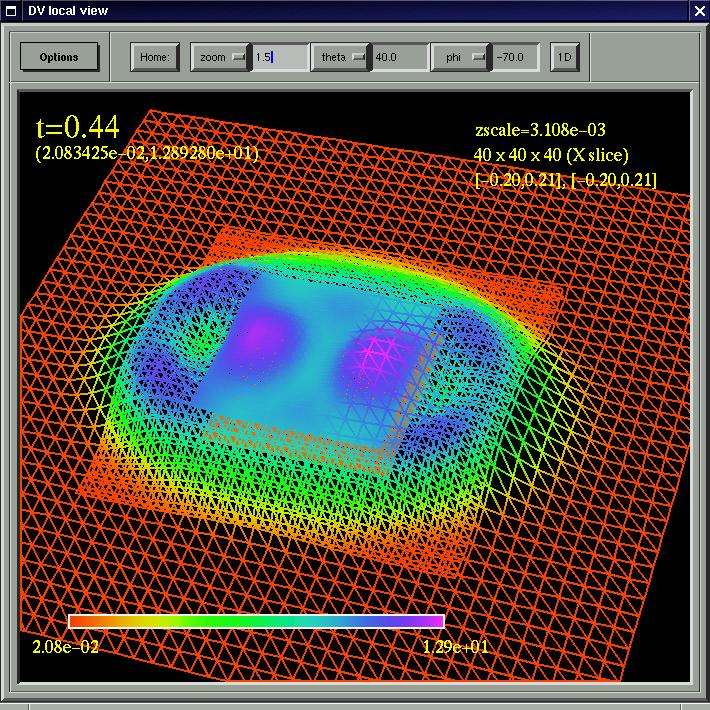

DV (DataVault) and xvs are freely available visualization packages,
written by [Matthew W.
Choptuik](http://laplace.physics.ubc.ca/People/matt/).

DV is a powerful visualization and data analysis package for numerical
codes that solve partial differential equations via grid-based methods,
in particular those utilizing adaptive mesh refinement (AMR) and/or
running in a parallel environment.\
DV provides a comprehensive set of built-in functions to analyze 1D, 2D,
and 3D time-dependent datasets, eg.

-   simple arithmetics
-   duplicating and merging datasets
-   filtering/masking
-   differentiation

xvs is a visualization tool for analyzing, among other things, the
output of time-dependent PDEs in one spatial dimension (or time
dependent cuts of higher-d solutions).

Since DV and xvs use the OpenGL graphics library, they can take full
advantage of the prodigious hardware of modern PC graphics cards. The
OpenGL model also provides fast and intuitive, mouse-based rotation and
zooming of rendered images.

For general information on scientific data visualization using DV and
xvs please refer to the [DV
tutorial](http://laplace.physics.ubc.ca/Doc/DV/) and the [xvs
documentation](http://laplace.physics.ubc.ca/~matt/410/Doc/xvs/).
Download and installation instructions for DV and xvs can be found
[here](http://laplace.physics.ubc.ca/People/matt/rnpletal.html).\
Also check out the UBC Physics & Astronomy Theory/Numerical Relativity
[Software and Related
page](http://laplace.physics.ubc.ca/Group/Software.html).

{width="100"} {width="100"}

### The DataVaultXVSutils Package

Both DV and xvs expect the data to be analyzed in SDF (simple data
format). Cactus does not support this format therefore data format
conversion utilities are needed.\
The DataVaultXVSutils package provides two utility programs which
convert Cactus output data into SDF:

-   `hdf5todv`\
    A utility program which reads an HDF5 datafile and sends its
    selected datasets in SDF format to a DV visualization server.
    Because DV is able to process unigrid as well as FMR datasets HDF5
    output files from both PUGH and Carpet can be sent and visualized.
-   `ascii1Dtoxvs.pl`\
    A perl script which reads 1D output files in ASCII format (as
    created by thorn `CactusBase/IOASCII`) and sends them to an xvs
    visualization server. Both gnuplot and xgraph/ygraph output files
    are supported.

#### Downloading and Installing

The OpenDXutils package can be downloaded from the Cactus svn server via
anonymous checkout:

       svn co http://svn.cactuscode.org/VizTools/DataVaultXVSutils/trunk/

A `GNUmakefile` is supplied with the package in order to build the
`hdf5todv` utility program. As prerequisites, HDF5 and the SDF libraries
must be installed on your system.

#### Selecting Datasets with `hdf5todv`

`hdf5todv` can be called with an optional index vector to select
individual datasets in the HDF5 input file. The vector can be given as a
comma-separated list of individual dataset indices and/or as a min-max
range with \'\*\' as wildcard character and an optional output frequency
argument.\
For example,

      hdf5todv -i '0,10,20-*/2' alp.h5

would select the first and the tenth dataset, and also every other
dataset in the HDF5 input file `alp.h5` starting from dataset 20.

### Support and Acknowledgements

[Thomas Radke](http://www.aei.mpg.de/~tradke) is the author and
maintainer of the DataVaultXVSutils package. The development work has
been supported by the [Deutsches Forschungsnetz
Verein](http://www.dfn.de) through the [GriKSL
project](http://www.griksl.org) under contract TK 602 - AN 200.

Please report bugs and send any comments to the
[maintainer](mailto:tradke@aei.mpg.de) of the DataVaultXVSutils package.

The software in the DataVaultXVSutils package is available under the GNU
General Public License. In addition to the conditions in the GNU General
Public License, the authors strongly suggest **using this software for
non-military purposes only.**
