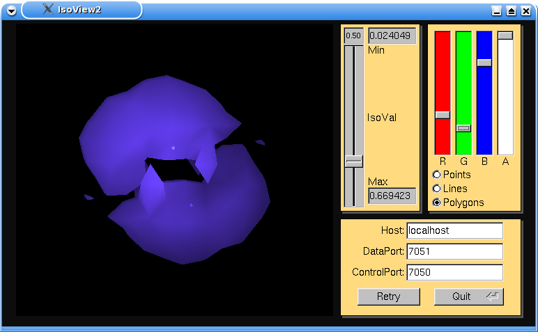

+-----------------------------------------------------------------------+
| IsoView - The lightweight IsoSurfacer Visualization Client            |
| ==========================================================            |
|                                                                       |
| [{width="400" height="300"}](isoview.png)             |
| =========================================================             |
|                                                                       |
| ### About                                                             |
|                                                                       |
| **Current Version: 2.0 RC1**                                          |
|                                                                       |
| IsoView version 2 was developed to replace IsoView version 1, which   |
| was heavily dependent on VTK. IsoView version 2 uses pure OpenGL to   |
| handle rendering, making it very lightweight. IsoView V2 is a         |
| visualization client originally developed for the CactusCode project  |
| at Lawrence Berkeley National Laboratory, and now is maintained and   |
| developed at Louisiana State University.                              |
|                                                                       |
| ### Files                                                             |
|                                                                       |
| **IsoView**                                                           |
|                                                                       |
| -   [MD5SUMS](IsoView-RC1-MD5SUMS) - MD5 sums for current tar balls   |
| -   [IsoView-RC1-Linux.tar.bz2](IsoView-RC1-Linux.tar.bz2) - IsoView  |
|     Linux binary, tar-bzip format                                     |
| -   [IsoView-RC1-Linux.tar.gz](IsoView-RC1-Linux.tar.gz) - IsoView    |
|     Linux binary, tar-gzip format                                     |
| -   [IsoView-RC1-Macintosh.tar.bz2](IsoView-RC1-Macintosh.tar.bz2) -  |
|     IsoView Macintosh binary, tar-bzip format                         |
| -   [IsoView-RC1-Macintosh.tar.gz](IsoView-RC1-Macintosh.tar.gz) -    |
|     IsoView Macintosh binary, tar-gzip format                         |
| -   [IsoView-RC1-source.tar.bz2](IsoView-RC1-source.tar.bz2) -        |
|     IsoView source, tar-bzip format                                   |
| -   [IsoView-RC1-source.tar.gz](IsoView-RC1-source.tar.gz) - IsoView  |
|     source, tar-gzip format                                           |
|                                                                       |
| **Other**                                                             |
|                                                                       |
| -   [IsoSurfacer.c](IsoSurfacer.c) - Updated IsoSurfacer.c to run     |
|     this version of IsoView.                                          |
| -   [WaveDemo.par](WaveDemo.par) - Updated WaveDemo.par file          |
|                                                                       |
| ### Installation                                                      |
|                                                                       |
| -   Get the IsoView source                                            |
| -   Untar the package and enter the IsoView directory                 |
| -   Alter the make file, changing the second line to match your TCPXX |
|     installation                                                      |
| -   If you did NOT install fltk to its normal place, or it is not in  |
|     your path, you will need to edit the makefile some more           |
| -   At this point, if everything is setup correctly, and the code     |
|     gods smile, then all you should need to do is \'make\'            |
|                                                                       |
| **Updating the WaveToy Demo** If you did not checkout IsoSurface from |
| the development branch of CVS, you will need to update your           |
| IsoSurfacer.c file. You will also need to update your parameter file. |
|                                                                       |
| -   Get the IsoSurface.c file, and place it in:                       |
|     Cactus/arrangements/CactusPUGHIO/IsoSurfacer/src, overwriting the |
|     current file                                                      |
| -   Now download and use the new parameter file                       |
|                                                                       |
| ### Tested Platform                                                   |
|                                                                       |
| **Linux**                                                             |
|                                                                       |
| -   Slackware 10.0 - 2.6.10 on i686 using MESA                        |
|                                                                       |
| **Macintosh**                                                         |
|                                                                       |
| -   OS 10.3 - 7.6.0 on a PowerBook G4                                 |
|                                                                       |
| ### Known Issues                                                      |
|                                                                       |
| -   You may see some warnings about using deprecated functions during |
|     compile. These are related to TCPXX, and I have no control over   |
|     them.                                                             |
| -   When steering, some IsoValues result in very strange results. I   |
|     believe this is a bug with IsoSurfacer or the simulation, not     |
|     IsoView.                                                          |
|                                                                       |
| ### Bugs                                                              |
|                                                                       |
| Please e-mail bug reports to:                                         |
| [iwsmith(at)cct(dot)lsu(dot)edu](mailto:iwsmith%3Cat%3Ecct%3Cdot%3Els |
| u%3Cdot%3Eedu)                                                        |
+-----------------------------------------------------------------------+
